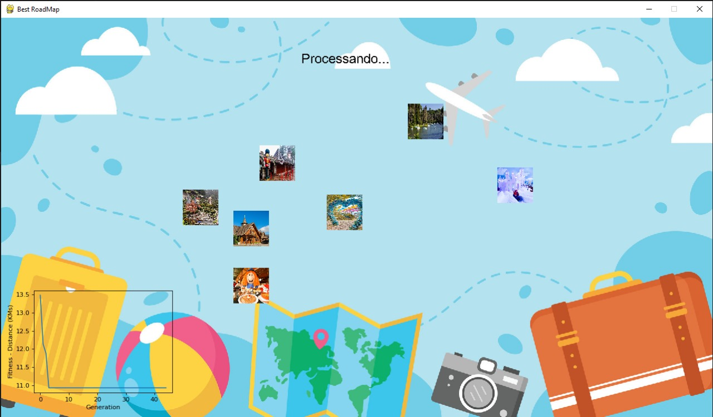
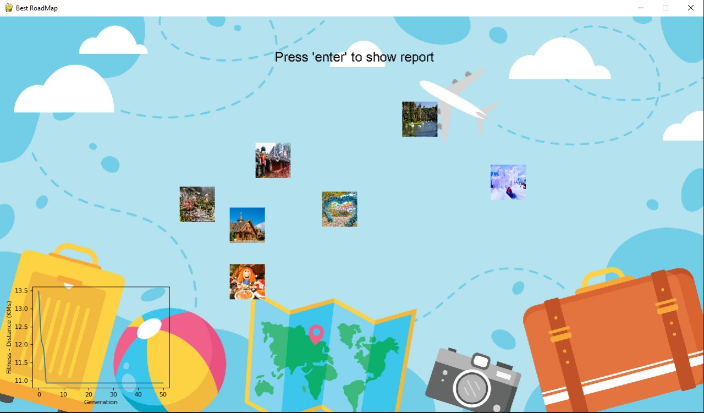
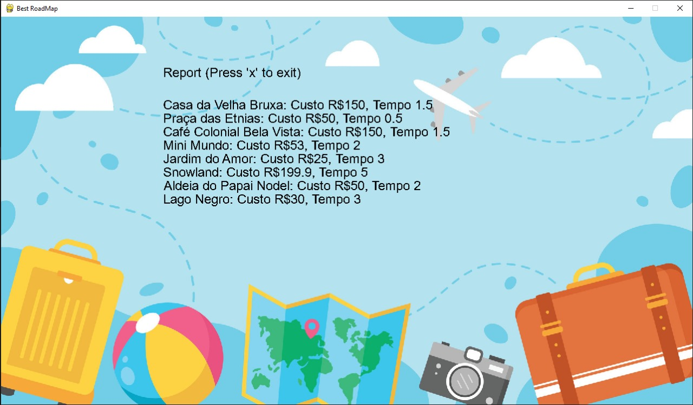

# Introdução
Projeto destinado ao **Desafio da Fase 2*** do curso de pós graduação "AI para devs" na FIAP.

## Desafio 
O desafio consiste em projetar, implementar e testar um sistema que  utilize Algoritmos Genéticos para otimizar uma função ou resolver um problema complexo de otimização. Você pode escolher problemas como otimização de rotas, alocação de recursos e design de redes neurais. 

## Problema a ser resolvido
Uma empresa de turismo deseja fornecer para os clientes um roteiro que esteja de acordo com o orçamento que eles possuem para viajar. Este roteiro deve ser o mais agradável possível para o cliente, evitando deslocamento demasiado de um evento para outro. 

Existe alguns requisitos que precisam serem atendidos:
- O roteiro não pode ter um destino repetido;
- Quanto menor a distância total pecorrida do roteiro, melhor;
- O custo total tem que estar abaixo do orçamento do cliente.

## Screenshots

## Como estar organizado
O projeto é formado pelas seguintes pastas e arquivos, com os respectivos propósitos:
- /images - pasta com todos arquivos de imagens que serão exibidas na execução da aplicação;
- app.py - contém o código da aplicação em sí;
- attraction.py - é o modelo da atração;
- draw_functions.py - reune as funções de desenhar algum tipo de conteúdo na tela;
- main.py - ponto de partida para execução do projeto;
- setup.py - contém várias constantes utilizadas no projeto;
- util.py - contém algumas funções utilitárias, como por exemplo converter geolocalização para pixel.

## Testes e Resultados
Em breve...

## Créditos
Copyright (C) by Deyvid Jaguaribe
